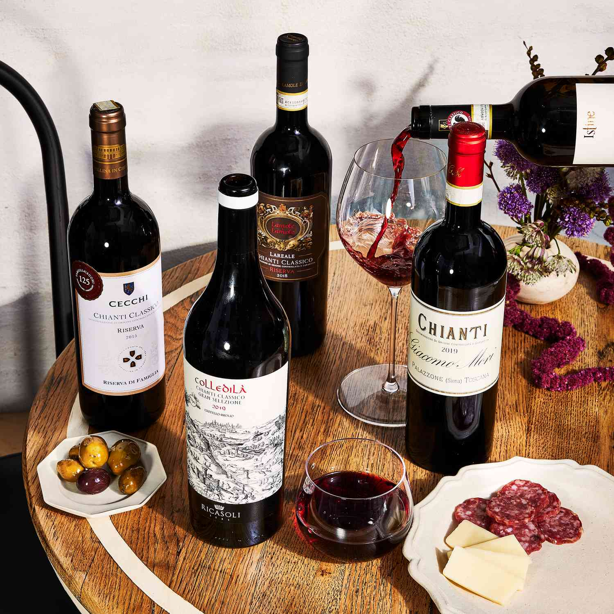

# Applied Data Science @ Columbia
## Spring 2024
## Project 1: A "Data Story" on how to choose a good wine 



### [Project Description](doc/)
This is the first and only *individual* (as opposed to *team*) this semester. 

Term: Spring 2024

+ Projec title: Do you really know about wine? A guideline of finding good wines

+ This project is conducted by [Rui Chen]

+ Project summary: [This article explores some interesting methods for finding good rating wine, utilizing data from Vivino. Firstly, it showed a slightly positive relationship between wine prices and its ratings, revealing that higher prices don’t guarantee better rating. It also states that wines from “Chilean” could serve as a high-value option, offering a better rating without the premium price. Additionally, this article finds out that some common words in high-rated wine names, suggesting a strong French influence, which can help people to make a good wine selection when they are purchasing wines!]

Following [suggestions](http://nicercode.github.io/blog/2013-04-05-projects/) by [RICH FITZJOHN](http://nicercode.github.io/about/#Team) (@richfitz). This folder is orgarnized as follows.

```
proj/
├── lib/
├── data/
├── doc/
├── figs/
└── output/
```

Please see each subfolder for a README file.
